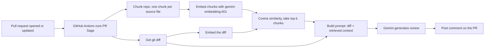

# PR Sage

**Context-aware AI code review for GitHub pull requests, packaged as a reusable GitHub Action.**

Most AI reviewers only see the lines that changed. PR Sage uses Retrieval-Augmented Generation (RAG) to also pull in the parts of your codebase most related to the change, so it can catch problems a diff alone can't show, like a changed function signature that breaks a caller in another file.

> Bring your own Gemini API key. Nothing from this repo is copied into yours, and there is no server to host.

---

## Quick start (use it in your own repo)

**1. Add your Gemini API key as a repository secret**

Get a free key from [Google AI Studio](https://aistudio.google.com/apikey), then in your repo go to **Settings → Secrets and variables → Actions → New repository secret** and add `GEMINI_API_KEY`. Or with the GitHub CLI:

```bash
gh secret set GEMINI_API_KEY
```

Never paste the key directly into a workflow file. Workflow files are committed to git, so a pasted key is visible to anyone who can read the repo.

**2. Add this workflow at `.github/workflows/review.yml`**

```yaml
name: AI PR Review

on:
  pull_request:
    types: [opened, synchronize]

permissions:
  contents: read
  pull-requests: write

jobs:
  review:
    runs-on: ubuntu-latest
    steps:
      - name: Checkout code
        uses: actions/checkout@v4
        with:
          fetch-depth: 0

      - name: AI code review
        uses: manavjungi/PR_Sage@v1
        with:
          gemini-api-key: ${{ secrets.GEMINI_API_KEY }}
```

`fetch-depth: 0` is required so the action can diff the base and head commits.

**3. Open a pull request.** The review appears as a comment within about a minute.

### Inputs

| Input | Required | Default | Description |
|---|---|---|---|
| `gemini-api-key` | yes | none | Your Gemini API key (pass it from a secret) |
| `github-token` | no | `github.token` | Token used to post the review comment |
| `top-k` | no | `3` | Number of related code chunks retrieved as context |

---

## How it works



1. **Trigger:** a workflow in the consuming repo runs on `pull_request` events and calls this action.
2. **Diff:** the action runs `git diff base..head` inside the consumer's checked-out repo (truncated to a bounded size).
3. **Chunk:** source files (`.py`, `.js`, `.ts`, `.java`, `.go`) become chunks, skipping `.git`, `.venv`, `node_modules` and similar. Each chunk is capped at 4000 characters.
4. **Embed:** every chunk and the diff are embedded with `gemini-embedding-001`. Both must use the same model, because vectors from different models are not comparable.
5. **Retrieve:** cosine similarity between the diff and each chunk, then take the top-k.
6. **Generate:** the diff plus the retrieved files go into a prompt that labels the extra files as reference-only, so the model reviews the diff and does not critique the context.
7. **Post:** the review is posted as a PR comment through the GitHub REST API.

### Project structure

```
action.yml                  # composite action manifest (the public interface)
src/pr_sage/
  review.py                 # orchestrator
  diff_utils.py             # git diff extraction
  chunker.py                # repo -> chunks
  embeddings.py             # embedding calls
  retriever.py              # cosine similarity + top-k
  prompts.py                # prompt construction
  gemini_client.py          # single shared Gemini client
  llm_client.py             # generation with model fallback
  retry_utils.py            # retry with exponential backoff
  github_api.py             # posts the PR comment
```

Each module has one job, so the chunking strategy, embedding model or LLM can be swapped without touching the rest.

---

## Design decisions

**GitHub Action instead of a GitHub App.** A GitHub App needs a hosted webhook server, a database of installations and token handling. A composite action runs on GitHub's own runners, so there is nothing to host or pay for. The trade-off is that it can't hold state between runs or offer a custom UI. If this needed multi-repo installs or persistent state, a GitHub App would be the right move.

**Composite action, so no code is copied into consumer repos.** GitHub fetches this repo at runtime into a temporary location and throws it away after the run. The consumer's repo only contains a short workflow file.

**RAG instead of diff-only or whole-repo prompts.** Diff-only misses cross-file effects. Stuffing the whole repo into the prompt is expensive and dilutes the model's attention. Retrieval sends only the most related files.

**File-level chunking.** One chunk per file is simple and works for small to medium repos. Function-level chunking would be more precise, but needs language-aware parsing.

**Fixed top-k of 3.** Too low can miss relevant context, too high adds noise and token cost. 3 is a reasonable default for small repos and can be changed with the `top-k` input.

**Reliability.** The Gemini free tier can return `503` during demand spikes. Calls retry with exponential backoff on transient errors only (`429`, `500`, `502`, `503`, `504`). A bad API key or malformed request fails immediately instead of retrying pointlessly. If the primary model is still unavailable, generation falls back to a second model. One file failing to embed is skipped and never fails the whole review.

**Bring your own key.** Each user supplies their own Gemini API key as a secret. Hosting a shared key would mean paying for everyone's usage.

**`uv` for dependencies.** `uv.lock` pins exact versions, so CI installs are reproducible and fast.

---

## Known limitations

- **Re-embeds the whole repo on every run.** Fine for small repos. Caching embeddings and only re-embedding changed files would be the next optimization.
- **File-level chunks.** Large files are truncated to 4000 characters, so retrieval can miss relevant code late in a file.
- **No similarity threshold.** The top-k chunks are always included, even when none are strongly related.
- **Free-tier rate limits.** The number of embedding calls grows with the number of files, so large repos may hit per-minute limits.
- **Fork PRs.** GitHub gives forked PRs a read-only token by default, so the comment step can fail for them.
- **Single summary comment.** The review is one PR comment, not inline comments on specific lines.
- **Model behavior.** LLM output is not deterministic. Treat the review as a second pair of eyes, not a replacement for human review.

## Possible improvements

- Function-level chunking with `ast` or tree-sitter
- Embedding cache (for example S3) so only changed files are re-embedded
- Move retrieval into a serverless function (for example AWS Lambda)
- Similarity threshold, and inline line-level comments
- Configurable model and temperature inputs

---

## Local development

```bash
git clone https://github.com/manavjungi/PR_Sage.git
cd PR_Sage
uv sync
```

The action is driven by environment variables (`GEMINI_API_KEY`, `GITHUB_TOKEN`, `REPO`, `PR_NUMBER`, `BASE_SHA`, `HEAD_SHA`, `TARGET_REPO_PATH`, `TOP_K`), so the simplest way to test changes end to end is to open a PR against a small test repo that uses this action.

## Tech stack

Python, GitHub Actions (composite action), Google Gemini (`google-genai`), `gemini-embedding-001`, NumPy, `uv`.

## License

MIT
